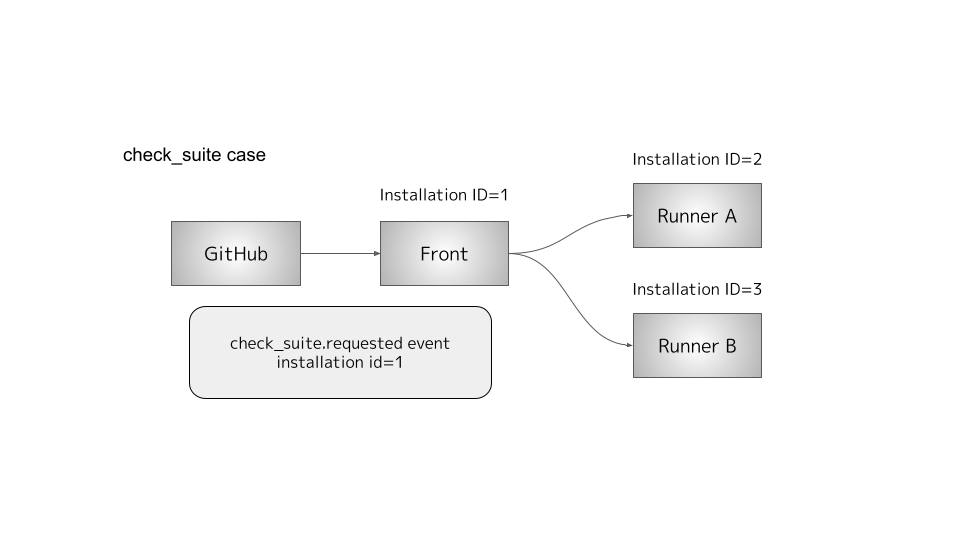
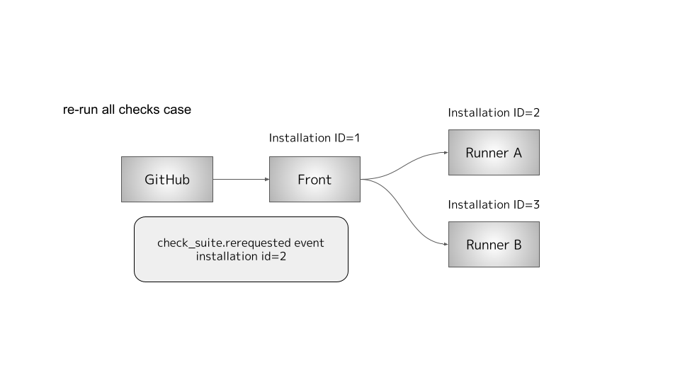
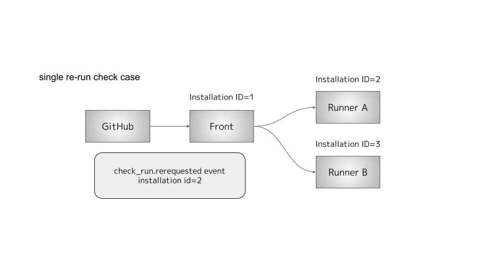

# Re-run Checks Documentation

This document explains how orgu handles re-run checks events. In orgu’s architecture, all webhook events from both the orgu-front and every runner’s GitHub App are received by the orgu-front component. The origin of each event is determined by checking the event’s `installation.id`.

## Prerequisites

- **Centralized Webhook Reception:** All GitHub Apps, both from orgu-front and from every orgu-runner, send their webhook events to the orgu-front server. As a result, orgu-front will also receive events generated by runner apps.
- **Event Discrimination:** orgu-front uses the `installation.id` field in the webhook payload to distinguish which GitHub App (and thus which component) generated the event.

## Pull Request Based Jobs

- **Event Filtering:** When using pull request–based jobs, orgu-front processes only events that belong to its own installation.
- **GitHub’s Behavior:** Even if only pull_request events are subscribed to, GitHub sends out `check_suite.requested` events for all installed GitHub Apps. Therefore, orgu-front must ignore any `check_suite.requested` events that do not match its own installation ID.
- **Runner Subscription:** Note that unless a runner’s GitHub App explicitly subscribes to pull_request events, pull_request events from other installations will not be forwarded to orgu-front.

## Check Suite Based Jobs

For jobs triggered by check_suite requests rather than pull_request events, the handling is slightly different:

- **orgu-front Filtering:** As before, orgu-front processes only events matching its own installation.
- **Runner Flexibility:** Runners, however, are designed to process CheckRequest objects even if the `installation.id` does not match their own. This is because orgu-front subscribes to all check_suite.requested events on behalf of all runners, allowing the runners to act on a broader set of events.

## Re-run All Checks Case

When a user clicks the **"re-run all checks"** button on Runner A’s Checks UI, the following occurs:

1. **Trigger**:
   GitHub sends a `check_suite.rerequested` event for the relevant installation.

2. **Front-End Handling**:
   orgu-front processes this event—even if it originates from a different installation—and publishes a corresponding CheckRequest to the event queue.

3. **Runner Handling**:
   Each runner inspects the `installation.id` within the CheckRequest and processes only those events that match its own GitHub App.

**Efficiency Consideration**:
   To optimize performance, the event queue’s filtering mechanism can validate whether the `installation.id` corresponds to either the orgu-front or a specific runner.

## Single Re-run Check Case

When a user clicks the **"re-run"** button for a specific check_run on Runner A’s Checks UI, the following occurs:

1. **Trigger**:
   GitHub sends a `check_run.rerequested` event for that particular check_run.

2. **Front-End Handling**:
   orgu-front accepts the event—regardless of the installation—and publishes a corresponding CheckRequest to the event queue.

3. **Runner Handling**:
   Each runner then inspects the `installation.id` in the CheckRequest and processes only those events that match its own GitHub App.

---

This design ensures that even when multiple installations are involved, orgu-front and the runners remain coordinated. The front-end strictly handles its own events, while runners are empowered to process broader CheckRequests as needed—always filtering by the correct installation ID. This strategy not only maintains clear boundaries between the different GitHub Apps but also optimizes event processing and resource usage.
